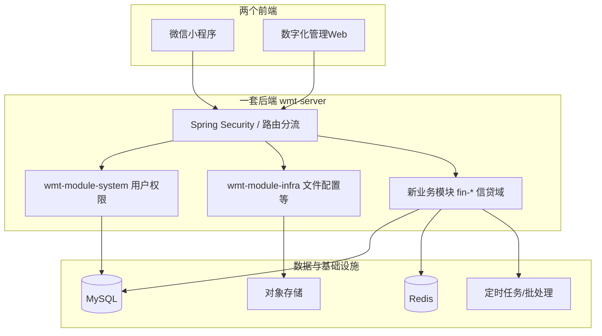

# 技术架构设计（Architecture）

**profile：`springboot`** — 对齐 `wmt-fullstack-pipeline-orchestrator-springboot`。

## 1. 总体结构

- **单一 Spring Boot 进程**（当前 `wmt-server` 模式），通过 **Maven 模块** 切分业务边界，避免“多个后端”带来的运维与一致性问题。
- **数字化管理** 与 **贷后** 在服务层分 **分包/子模块**；若未来独立扩容，可将 `postloan` 包拆为独立 Jar（进程级拆分），第一期不强制。

## 2. 逻辑分层（每业务模块内）

- **Controller**：仅 `CommonResult<T>`；`/admin` 与 `/app` 分包或类级 `@RequestMapping` 前缀区分。
- **Service**：业务规则、事务边界；抛出 `ServiceException`。
- **DAL**：`BaseMapperX` + Wrapper；禁止对外暴露 DO。
- **API 模型**：`xxx.dto`（入参）、`xxx.vo`（出参）、`xxx.dal.dataobject`（DO）。

## 3. 模块划分建议

| Maven 模块 | 职责 | 说明 |
|------------|------|------|
| `wmt-module-system` | IAM、组织、菜单、数据权限 | 保持为权威身份源 |
| `wmt-module-infra` | 文件、配置、部分技术组件 | 材料文件上传复用 |
| **`wmt-module-fin-customer`**（新建） | 小程序侧：申请、材料、进度、额度API | 仅依赖必要内核 |
| **`wmt-module-fin-admin`**（新建） | 管理端：进件、配置、驾驶舱、营销占位 | 强依赖数据权限 |
| **`wmt-module-fin-postloan`**（新建） | 贷后：监测、预警、催收 | 可被 admin 聚合调用 |

> 若希望减少模块数量：**一个 `wmt-module-fin-biz`** 内用包名划分 `customer` / `admin` / `postloan`，代价是单模块过重；多人协作时仍建议 **2～3 个 Maven 子模块**。

## 4. API 分流与安全

- **管理端**：Session/JWT（与现有 admin 一致）+ RBAC + 数据权限 API。
- **小程序**：建议 **OAuth2/OIDC 风格** 或 **自定义 Token**（与现有框架对齐）；微信 `code` 仅服务端交换，不落日志明文。
- **审计**：统一记录 `userId`、`tenantId`（如有）、`clientType`、`bizId`、`action`、`before/after`（敏感字段哈希或脱敏）。

## 5. 集成点

- **微信**：小程序登录、订阅消息（可选）、用户隐私协议引导。
- **对象存储**：材料、影像件；URL 带签名与过期；禁止永久公开桶。
- **批处理**：监测跑批、指标聚合、报送文件生成（异步 + 可重试）。

## 6. 与流水线下阶段衔接

- **阶段 4**：自 `architecture.md` 导出 **ERD + `schema.sql` + `openapi.yaml`**。
- **阶段 5～7**：后端单测/集成测 + 前端契约驱动 + Playwright 主路径。
- **门禁**：仓库根执行 `profiles/springboot/check-gates.ps1`（需从模板拷贝 `.delivery-pipeline` 后生效）。
