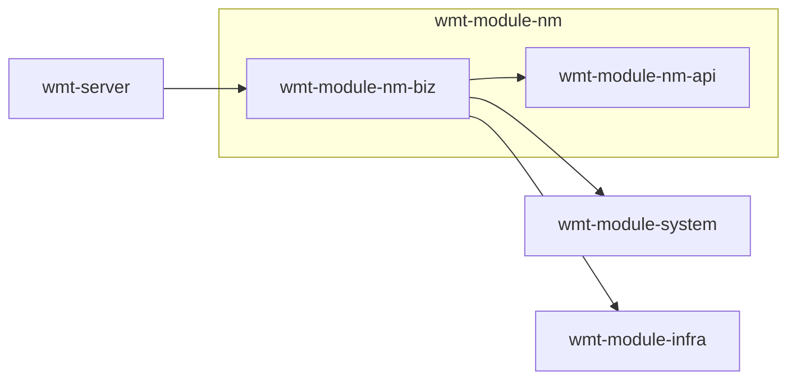

# nm 域 Maven 模块设计方案（先设计、后实现）

**状态**：设计稿 — 不要求与当前仓库代码一致；实现前需评审签字。  
**目标**：在 `ahzx-wmt-svc` 中新增 **「nm」大模块**（内蒙古普惠等业务），其下用 **Maven 子模块 + Java 子包** 细分能力；**现阶段不区分 app 端用户与 admin 端用户**（统一身份与鉴权策略，后续可演进）。

---

## 1. 设计原则

| 原则 | 说明 |
|------|------|
| **单域聚合** | 与 nm/普惠相关的需求优先落在 `wmt-module-nm-*`，避免散落在 `system`/`infra` 中难以演进。 |
| **Maven 子模块少、包内细分多** | 子模块数量保持可维护；**业务线**用 `com.wmt.module.nm...` 下**子包**划分，必要时再拆出新的 `wmt-module-nm-xxx` Jar。 |
| **暂不区分 C/B 用户类型** | 不单独建「app 用户模块 / admin 用户模块」；接口统一走一套鉴权（与现有 `wmt-module-system` 用户体系对齐方式见 §5）。 |
| **与框架一致** | Controller 返回 `CommonResult`；分页 `PageParam`/`PageResult`；Mapper `BaseMapperX`；异常 `ServiceException`（与仓库规则一致）。 |

---

## 2. Maven 结构（推荐）

```
wmt-module-nm/                          packaging: pom（聚合父工程）
├── pom.xml
├── wmt-module-nm-api/                  jar：枚举、常量、跨包 DTO（无 Spring）
│   └── com.wmt.module.nm.api.*
└── wmt-module-nm-biz/                  jar：Controller + Service + DAL + framework 配置
    └── com.wmt.module.nm.*
```

**根工程 `pom.xml`**：增加 `<module>wmt-module-nm</module>`（与 `wmt-module-system` 并列）。  
**`wmt-server`**：仅依赖 `wmt-module-nm-biz`（`api` 由 `biz` 传递或显式依赖均可，建议 `biz` 依赖 `api`）。

**何时再拆 Maven 子模块**（触发条件示例）：

- `nm-biz` 单 Jar 代码量/编译时间明显拖慢 CI；
- 某条线需**独立版本发布**或**被其他系统依赖**（例如单独 `wmt-module-nm-integration` 只放 ESB 适配器）。

---

## 3. `wmt-module-nm-biz` 内 Java 子包划分（按需求域）

> 与《小程序需求》章节大致对应，便于任务分派与代码导航。

| 子包（建议） | 职责 | 需求映射（示例） |
|--------------|------|------------------|
| `...nm.controller` | HTTP 入口，统一路径前缀 | 对外 REST |
| `...nm.service.account` | 注册、登录、会话、短信验证码、忘记密码 | 3.1 |
| `...nm.service.profile` | 个人信息、L1/L2 实名 | 3.2.1 |
| `...nm.service.company` | 我的企业、绑企、工商/二三要素、默认企业 | 3.2.4 |
| `...nm.service.product` | 首页 Banner、产品列表/详情/搜索 | 3.2.6、3.2.7 |
| `...nm.service.application` | 融资申请、授权书、确认提交、重复进件规则 | 3.2.7 |
| `...nm.service.limit` | 我的额度、额度详情 | 3.2.2（部分） |
| `...nm.service.contract` | 电子合同模板、签约编排、影像查看 | 3.2.2 |
| `...nm.service.drawdown` | 借款（提款）申请、与核算交互 | 3.2.2 |
| `...nm.service.loan` | 借据、还款计划、还款申请、试算 | 3.2.3 |
| `...nm.service.progress` | 申请进度列表与详情 | 3.2.5 |
| `...nm.integration` | 腾讯、短信、签章、ESB、信贷、核心、ODS 等适配器（防腐层） | 第二章 |
| `...nm.dal.mysql` | Mapper + DO | 全域 |
| `...nm.framework.config` | Swagger 分组、模块级 Bean | 与 `CreditWebConfiguration` 同类 |

**命名约定**：REST 路径建议统一前缀 **`/nm`** 或 **`/fin/nm`**（二选一全局定稿，避免与现有 `/admin-api`、`/app-api` 文档冲突后再迁移）。

---

## 4. `wmt-module-nm-api` 职责边界

- **只放**：错误码常量、枚举（申请状态、签约状态、实名等级）、跨子包复用的 **纯 DTO**（无 Spring / 无 MyBatis 注解若可接受则放 api，否则放 biz `vo`）。
- **不放**：Controller、Service 实现、Mapper。

---

## 5. 身份与鉴权（「暂不区分 app/admin」的设计含义）

**含义**：不在 nm 内再建两套「用户类型」模型；**先**复用现有 **`wmt-module-system` 用户/登录体系**（或后续与 `member` 合并的单一决策），nm 只关心 **业务租户（企业）与业务单据**。

**接口暴露策略（两档演进）**：

1. **当前档**：nm 的 Controller 与现有管理端/C 端**共用同一套登录态**（同一 `SecurityContext` 中的 `userId`），仅通过 **URL 前缀 + 权限注解** 控制谁能调（若暂时全部对内网开放，则后续再收紧 —— 需在安全设计里显性记录风险）。
2. **演进档**：当需要区分客户端时，再引入 `UserType` 或 `client_id` 维度；**不必改 Maven 结构**，改 Security 配置与注解即可。

---

## 6. 与现有模块依赖关系



- **依赖 `system`**：组织、用户、权限、字典等若 nm 需要读取。  
- **依赖 `infra`**：文件、配置、短信/第三方 HTTP 客户端等复用。  
- **不循环依赖**：nm 不反向被 `system` 依赖；若需回调，用 **事件 / MQ / 表任务** 解耦。

---

## 7. 数据与契约

- **表命名**：建议统一前缀 `nm_`（如 `nm_company`、`nm_loan_application`），与现有表区分。  
- **契约**：`docs/delivery-lending-platform/04-data-contracts/openapi.yaml` **增量**增加 `nm` tag 与路径（实现阶段再做，设计阶段只定「是否共用一个 openapi 文件」—— **建议共用**）。  
- **对外集成**：全部经 `...nm.integration` 防腐层，便于单测 Mock 与切换 ESB 实现。

---

## 8. 非功能与安全（设计占位）

- **审计**：关键写操作记 `userId`、`bizId`、`action`、脱敏前后摘要（与架构文档审计字段一致）。  
- **限流**：登录、短信、人脸相关接口预留 **Redis 限流** 扩展点。  
- **配置**：第三方 URL、模板 ID、开关一律 **走 Nacos/DB 配置表**，禁止硬编码。

---

## 9. 实现前检查清单（评审用）

- [ ] 根 `pom` 与 `wmt-server` 依赖变更是否纳入发布计划  
- [ ] REST 前缀与网关/Nginx 路由是否一致  
- [ ] 表前缀与 DBA 命名规范  
- [ ] 与信贷/核心/ESB 的 **主数据 ID** 映射（客户号、企业号、借据号）  
- [ ] 需求澄清项（注册跳转、口令长度、双验顺序等）是否已关闭  

---

## 10. 与仓库中已有骨架的关系

若存在未接入根 `pom` 的 `wmt-module-nm` 目录：**实现前**要么删除以免误导，要么在 README 标明「未启用」；**以本设计文档与评审结论为准**。

---

*文档维护人：项目组；变更时请更新 §10 与版本记录。*
