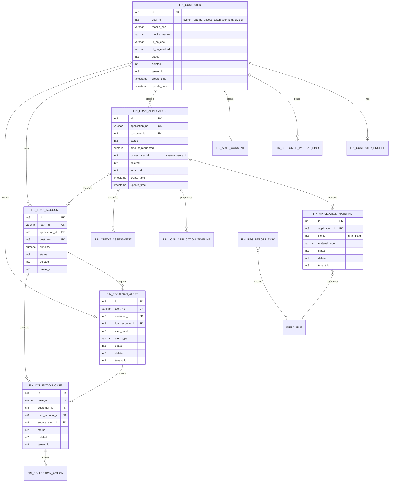

# ERD（核心域）— Lending Digital Platform

> 本 ERD 只覆盖新建的 `fin_*` 业务域表；`system_*`（用户/权限/OAuth2）与 `infra_*`（文件等）视作既有依赖。

## 关联既有表（不在本 ERD DDL 中创建）

- `system_users`: 后台用户（OWNER/经办人/催收人员等）
- `system_oauth2_access_token`: Token 校验与 `user_id/user_type`（MEMBER/ADMIN）
- `infra_file`: 文件元数据（材料/报送导出文件引用）

