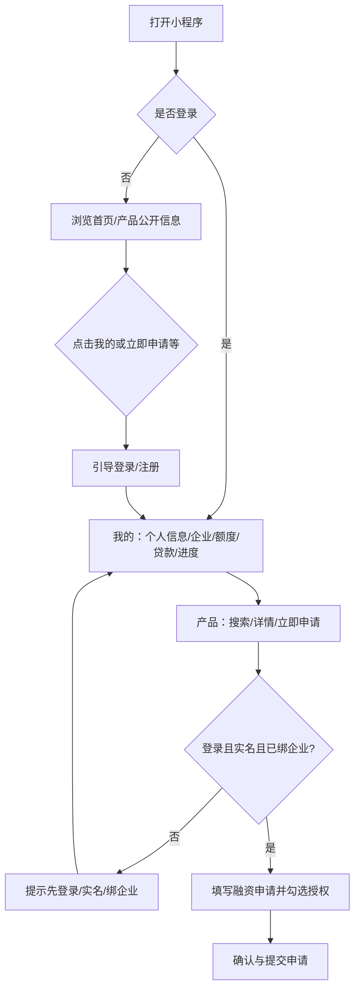
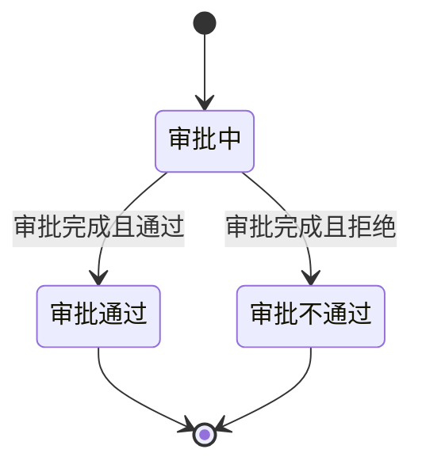
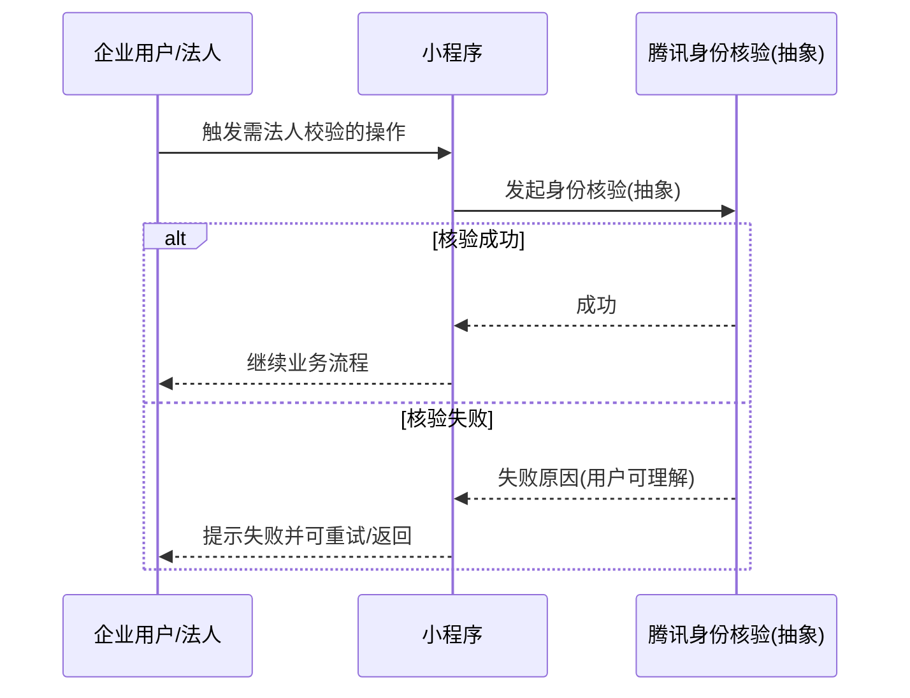

# 产品需求文档：内蒙古银行普惠金融产品线上化及数字化系统（小程序进件端）- V0.1

> **追溯说明（解析与一致性）**  
> - **来源文件**：`docs/nm-deliver/0508-1.doc`、`docs/nm-deliver/0508-1.docx`（二者 **字节级完全一致**，均为 Microsoft Word **OLE2 复合文档**，扩展名 `.docx` 实为同名副本，非标准 OOXML）。  
> - **全文抽取**：`antiword`（约 **2859** 行纯文本；正文中原型图为 `[pic]` 占位）。  
> - **结论**：两文件解析结果一致，无「需改用 docx 解压解析」的差异；图片与版式以招标材料《界面原型》为准。  
> - **文档缺口（原文状态）**：第二章「数字化管理平台主要功能」标题下 **无展开正文**；风险控制/业务量/用户量/信息安全/外围接口清单等多处为 **模板空表**。本 PRD **仅基于 SRS 已写明的文本做加固**，缺口列入「待澄清」，**不臆造**管理平台功能清单。

> **与结构真源同步（2026-05-12）**：进件域持久化以 **`docs/nm-deliver/sql/pfb-core-schema-v0.sql`（v0 DDL）** 为最新真源。本期小程序交付 **含首页 Banner 轮播**（表 **`pfb_banner`**，与后端一期公开 `banner/list` 一致）；自然人进件主数据表为 **`pfb_individual_customer`**；企业主数据 **`pfb_ent_info.company_credit_code` 必填（NOT NULL）**；融资申请含 **`ent_id` 与企业名称/统一社会信用代码快照**。下文 US 中与上述冲突的旧表述已按本段回刷。

**本需求交付物索引（均在 `docs/nm-deliver/`）**

| 文档 | 路径 |
|------|------|
| 原始 SRS（Word） | `docs/nm-deliver/0508-1.doc` / `0508-1.docx` |
| 加固 PRD（本文件） | `docs/nm-deliver/PRD-普惠金融数字化系统-小程序-需求加固-V0.1.md` |
| 核心表结构 DDL v0（`pfb_*` / UUID / `pfb_banner` / `pfb_individual_customer` / 申请 `ent_id`+企业快照；`pfb_ent_info.company_credit_code` NOT NULL） | `docs/nm-deliver/sql/pfb-core-schema-v0.sql` |
| 后端计划索引（指向一期 / 二期） | `docs/nm-deliver/superpowers/plans/2026-05-11-pfb-miniprogram-backend-mvp.md` |
| 后端一期任务（与 v0 DDL 对齐；含数据库初始化） | `docs/nm-deliver/superpowers/plans/2026-05-11-pfb-phase1-backend-tasks.md` |
| 后端二期任务（检索、进度、幂等、运营等） | `docs/nm-deliver/superpowers/plans/2026-05-11-pfb-phase2-backend-tasks.md` |
| WMT 框架 JDK17 源码根（CommonResult、BaseDO 等；与业务仓分离） | 本机示例：`/Users/whiskey/Projects/Github/Whiskey1028/wmt-framework/wmt-framework-jdk17`；类级 `file://` 见一期计划「组件库」节 |

---

## 1. 综述 (Overview)

### 1.1 项目背景与核心问题

内蒙古银行普惠金融部建设「普惠金融产品线上化及数字化系统」，面向小微企业等客群，通过 **微信小程序进件端** 完成注册登录、实名与企业绑定、产品浏览与融资申请、额度与合同相关操作、借还款与进度查询等能力；并与行内 **ESB、核心、信贷、短信、电子签章、腾讯人脸、ODS** 等协同（详见 SRS 第二章）。

**本期 PRD 边界**：SRS 第三章「小程序端业务需求」已展开部分——作为开发对齐的主线；**管理平台（审批、客户经理作业台等）** 在 SRS 中仅流程层面提及，**缺少独立功能规格**，须在合同/招标附件或单独需求中补齐后方可纳入同一 PRD 版本。

**约束摘录（来自 SRS）**：须符合相关法律法规及监管报送要求；项目总工期不超过 **40 周**；参照 JR/T 0171、JR/T 0071 等规范。

### 1.2 核心业务流程 / 用户旅程地图

将小程序侧叙事划分为下列阶段（与 SRS 业务流程一致）：

1. **阶段一：准入与账号** — 游客浏览公开内容；需办理业务时完成登录/注册/找回密码，建立企业用户账号。
2. **阶段二：实名与企业** — 完成 L1/L2 实名、绑定企业、法人短信与人脸等核验（按需触发）。
3. **阶段三：融资申请** — 浏览首页/产品，在线发起融资申请，签署信用信息查询及报送授权。
4. **阶段四：授信与合同（客户侧）** — 在额度状态允许时查看额度、配合合同签署相关校验（短信/人脸）；具体启用与合同生成依赖 **客户经理侧**（SRS 描述存在，**管理端规格缺失**）。
5. **阶段五：借还款与进度** — 查看借据与还款计划、发起还款试算/还款申请并完成法人校验；查询申请进度与审批详情展示字段。
6. **阶段六：贷后（概要）** — SRS 总体流程含贷后管理；**小程序章节未单独展开贷后客户功能**，若需端侧能力须另列版本范围。

### 1.3 Mermaid 图（流程/状态/时序）

> 说明：以下为需求视角抽象；不包含接口名、字段、HTTP 状态码或框架。

#### 1.3.1 用户操作流（必填）



#### 1.3.2 状态机（融资申请进度 — 客户可见）



> 注：内部子状态（风控初审、人工审批、合同签署中等）SRS 未在小程序章节完整展开，**待与管理端/信贷流程对齐后细化**。

#### 1.3.3 关键场景时序（法人身份核验 — 抽象）



---

## 2. 用户故事详述 (User Stories)

### 阶段一：准入与账号

---

#### **US-01: 作为未登录用户，我希望在未登录时仍能浏览公开信息与产品，以便于先了解产品再决定是否登录**

*   **价值陈述 (Value Statement)**:
    *   **作为** 未登录访客
    *   **我希望** 浏览产品介绍列表、产品详情、资讯公告等允许公开的内容
    *   **以便于** 降低了解产品的门槛
*   **业务规则与逻辑 (Business Logic)**:
    1.  **前置条件**: 无。
    2.  **操作流程 (Happy Path)**: 进入小程序 → 浏览首页 **Banner 轮播**（数据来自 **`pfb_banner`**，公开接口见实施计划）→ 浏览热门产品、进入产品列表与详情（与 v0 DDL、MVP 一致）。
    3.  **异常处理**: 若访问需身份的功能（如「我的」内子模块、「立即申请」在需登录场景），引导登录（SRS：未登录点击「我的」相关入口 → 等待登录页；点击需登录业务 → 引导登录）。
*   **验收标准 (Acceptance Criteria)**:
    *   **场景1: 公开浏览**
        *   **GIVEN** 用户未登录
        *   **WHEN** 访问首页（含 Banner、热门产品区）与产品列表/详情（SRS 允许范围）
        *   **THEN** 可正常浏览公开内容
    *   **场景2: 受限入口**
        *   **GIVEN** 用户未登录
        *   **WHEN** 点击「我的」或业务要求的「立即申请」等入口
        *   **THEN** 进入登录引导流程（与原型图 3.1.1.x / 3.4.x 一致）
    *   **场景3: 首页 Banner（与 v0 DDL 一致）**
        *   **GIVEN** 存在上架且在生效时间内的轮播数据
        *   **WHEN** 打开首页
        *   **THEN** 展示 Banner 区域并可展示轮播图（无数据时可隐藏该区域，以 UI 为准）

*   **页面布局线框图 (ASCII Wireframe)**:

```text
+---------------------------+
| [Banner 轮播]             |
|---------------------------|
| 热门产品                   |
| [产品卡片 x N] [立即申请] |
|---------------------------|
| [首页] [产品] [我的]       |  <- 当前 Tab 高亮为主色红
+---------------------------+
```

---

#### **US-02: 作为企业用户，我希望使用手机号密码与验证码登录，以便于安全访问我的业务**

*   **价值陈述**: **作为** 已注册用户 **我希望** 使用手机号+密码并完成短信验证码等校验 **以便于** 符合双因子安全要求（SRS：手机号密码登录+验证码双因子）。
*   **业务规则与逻辑**:
    1.  **前置条件**: 已完成注册。
    2.  **Happy Path**: 进入登录页 → 输入凭据与验证码 → 登录成功 → 进入「我的」成功页（展示姓名、手机号、默认企业等，见 SRS 登录成功页描述）。
    3.  **异常**: 验证码错误、密码错误等须有用户可理解提示（原文未逐条枚举文案时，以原型与 UAT 补齐为准）。
*   **验收标准**:
    *   **GIVEN** 合法账号
    *   **WHEN** 输入正确凭据与验证码并提交
    *   **THEN** 进入已登录态并可访问「我的」子模块

*   **页面布局线框图 (ASCII Wireframe)**:

```text
+---------------------------+
| 登录                       |
| 手机号 [___________]       |
| 密码   [___________]       |
| 验证码 [____] [获取验证码] |
| [登录]                     |
| [立即注册] [忘记密码]       |
+---------------------------+
```

---

#### **US-03: 作为新用户，我希望完成注册并校验手机号，以便于创建账号**

*   **价值陈述**: **作为** 新用户 **我希望** 填写姓名、身份证号、手机号等并完成短信验证 **以便于** 建立账户（SRS 注册采集项）。
*   **业务规则与逻辑**:
    1.  **前置条件**: 无账号或选择注册入口。
    2.  **Happy Path**: 注册信息填写 → 短信验证码校验 → 同意协议 → 提交注册。
    3.  **异常**: 验证码失败、重复注册等。
*   **验收标准**:
    *   **GIVEN** 新手机号
    *   **WHEN** 完成验证码校验并提交合规信息
    *   **THEN** 注册成功并可登录

```text
+---------------------------+
| 注册                       |
| 姓名/身份证/手机号...       |
| 验证码 [____] [获取]       |
| [ ] 用户注册协议（可查看）  |
| [提交注册]                 |
+---------------------------+
```

---

#### **US-04: 作为用户，我希望在忘记密码时重置密码，以便于恢复访问**

*   **价值陈述**: **作为** 用户 **我希望** 通过手机验证码重置密码 **以便于** 恢复账号可用。
*   **业务规则与逻辑**: 前置：持有可用手机号；流程：忘记密码 → 验证码校验 → 设置新密码（SRS 章节 3.1.3）。

*   **验收标准**:
    *   **GIVEN** 账号存在且手机号可用
    *   **WHEN** 完成验证码校验并提交新密码
    *   **THEN** 可使用新密码登录

---

### 阶段二：实名与企业

---

#### **US-05: 作为企业用户，我希望完成 L1/L2 实名与必要核验，以便于发起业务受理**

*   **价值陈述**: **作为** 企业用户 **我希望** 完成 L1（手机+短信）与 L2（身份证 OCR+公安比对）及绑企业时的法人活体识别 **以便于** 满足实名要求后再办理业务（SRS 实名体系描述）。
*   **业务规则与逻辑**:
    1.  **前置条件**: 已登录。
    2.  **Happy Path**: 进入个人信息 → 按引导完成 L1/L2 → 通过后允许后续绑企业、申请等。
    3.  **异常**: OCR/比对/活体失败 → 阻断或重试策略以原型与业务为准。
*   **验收标准**:
    *   **GIVEN** 用户未完成规定等级实名
    *   **WHEN** 尝试发起融资申请等需实名能力
    *   **THEN** 提示先完成实名（SRS 融资申请跳转判断链路与弹窗文案）

*   **页面布局线框图 (ASCII Wireframe)**:

```text
+---------------------------+
| 个人信息                   |
| 实名状态: L1/L2 展示        |
| [去认证] [OCR/比对结果区]  |
| ...                       |
+---------------------------+
```

---

#### **US-06: 作为企业用户，我希望管理绑定企业并完成法定代表人短信与人脸核验，以便于以企业身份办理融资**

*   **价值陈述**: **作为** 用户 **我希望** 查看/切换企业、添加企业、完成法人短信与人脸（SRS：添加企业、法人手机验证码、人脸识别；企业信息列表与切换）。
*   **业务规则与逻辑**:
    1.  **前置条件**: 已登录；绑企业与核验规则以 SRS 各小节为准。
    2.  **外围**: SRS 明确「添加企业」等能力调用 **腾讯身份核验服务**（文本抽取见 SRS 3.2.4 相关小节）。
    3.  **与 v0 DDL 一致**：企业主数据 **`pfb_ent_info.company_credit_code` 必填（NOT NULL）**；建档或编辑企业时须校验统一社会信用代码完整合法，否则无法落库或与融资申请授权书变量对齐。
*   **验收标准**:
    *   **GIVEN** 用户添加或切换企业
    *   **WHEN** 触发法人核验
    *   **THEN** 调起腾讯云核验并完成结果反馈（成功/失败用户可感知）

```text
+---------------------------+
| 我的企业                   |
| [企业A] [企业B]  [切换]    |
| [+ 添加企业]               |
+---------------------------+
```

---

### 阶段三：融资申请（首页/产品）

---

#### **US-07: 作为访客或登录用户，我希望在首页查看 Banner 与热门产品，以便于进入产品及申请**

*   **价值陈述**: **作为** 用户 **我希望** 在首页看到 **Banner 轮播** 与热门产品并可跳转详情 **以便于** 快速了解行方推广信息与产品（与 **`pfb_banner` + `pfb_loan_product`** 及 `docs/nm-deliver/sql/pfb-core-schema-v0.sql`、实施计划一致）。
*   **业务规则与逻辑**:
    1.  Banner 数据来自运营配置；展示规则含上架状态与可选生效时间窗（字段语义见 v0 DDL `pfb_banner`）。
    2.  「查看更多」→ 产品 Tab；产品卡片「立即申请」→ 产品详情（与 SRS 一致部分保留）。
    3.  底部导航当前 Tab 为主色红，其余黑。
    4.  点击「我的」：未登录 → 等待登录页。

*   **验收标准**:
    *   **场景1: Banner**
        *   **GIVEN** 存在上架且在生效时间内的轮播图
        *   **WHEN** 打开首页
        *   **THEN** 展示 Banner 区域并可轮播（点击跳转行为以 `link_url` 配置为准，以 UI 为准）
    *   **场景2: 热门产品**
        *   **GIVEN** 存在可展示的热门产品数据
        *   **WHEN** 打开首页
        *   **THEN** 展示热门产品区域并可进入详情（以 UI 为准）

*   **页面布局线框图 (ASCII Wireframe)**:

```text
+---------------------------+
| [Banner 轮播]             |
|---------------------------|
| 热门产品    [查看更多]     |
| [卡片:额度/利率/立即申请]  |
|---------------------------|
| [首页*] [产品] [我的]      |
+---------------------------+
```

---

#### **US-08: 作为用户，我希望在产品列表搜索并查看详情，以便于选择合适产品**

*   **价值陈述**: **作为** 用户 **我希望** 按名称搜索产品、查看列表与详情 **以便于** 决策（SRS：搜索框默认提示文案；无数据展示「暂无数据」；详情「立即申请」需判断是否登录）。

*   **验收标准**:
    *   **GIVEN** 无匹配产品
    *   **WHEN** 搜索
    *   **THEN** 列表区展示「暂无数据」

---

#### **US-09: 作为已登录且完成实名与绑企业的用户，我希望发起融资申请并勾选授权，以便于提交合规申请**

*   **价值陈述**: **作为** 符合条件的企业用户 **我希望** 填写申请金额（**10000 元整数倍**、长度限制见 SRS）、期限（**6/12 个月**）、还款方式（三选一），并阅读勾选《信用信息查询及报送授权书》 **以便于** 提交申请。

*   **业务规则与逻辑**（摘自 SRS 融资产品申请）:
    1.  进入申请页前依次判断：**登录 → 实名 → 已绑企业**；否则弹窗或跳转（文案见 SRS 图 3.4.2-x）。
    2.  「下一步」：金额/期限/还款方式必选；金额未填提示「请输入申请金额」；期限默认 12 个月；还款方式默认「按月付息到期还本」。
    3.  授权书 **默认不勾选**；未勾选时「下一步」**灰色不可点**；勾选后方可点击（SRS 图 3.4.2-4/5）。
    4.  授权书页变量：产品名称、企业名称、统一社会信用代码自动填充；返回后自动勾选授权勾选框（SRS 融资申请授权书查看）。

*   **验收标准**:
    *   **GIVEN** 用户未勾选授权书
    *   **WHEN** 查看「下一步」
    *   **THEN** 按钮为禁用态且不可提交

```text
+---------------------------+
| < 贷款申请                 |
| 借款人/企业代码/联系人...  |
| 申请金额 [____] (10000整数倍)|
| 期限 [12个月 v] 还款方式...|
| [ ] 《信用信息查询及报送授权书》|
| [下一步: 未勾选则灰显]      |
+---------------------------+
```

---

### 阶段四：授信与合同（客户侧 — 依赖银行侧作业）

---

#### **US-10: 作为授信通过用户，我希望查看额度与配合合同签署相关校验，以便于完成签约前准备**

*   **价值陈述**: **作为** 用户 **我希望** 查看额度列表/详情，并在合同环节完成短信与人脸等校验 **以便于** 推进签约（SRS「我的额度」各子状态与图示）。

*   **业务规则与逻辑**:
    1.  SRS 多次出现「客户经理生成/启用合同」等 **银行侧动作**，小程序表现为多种页面状态（额度审批通过未签约/已签约等）。
    2.  **缺口**: 管理端与客户经理操作规格缺失 → **状态与字段最终以信贷对接与管理端 PRD 为准**。

*   **验收标准**:
    *   **GIVEN** 授信审批通过且业务允许展示额度信息
    *   **WHEN** 用户进入「我的额度」
    *   **THEN** 展示 SRS 所列字段与按钮可用性（与原型一致）

---

### 阶段五：借还款与进度

---

#### **US-11: 作为借款用户，我希望查看借据与还款计划并发起还款相关操作，以便于管理负债**

*   **价值陈述**: **作为** 用户 **我希望** 查看借据列表/详情、还款计划，并进行还款试算与还款申请（含法人短信与人脸，见 SRS「我的贷款」）。

*   **验收标准**:
    *   **GIVEN** 存在借据
    *   **WHEN** 打开还款计划
    *   **THEN** 展示该借据各期信息（SRS）

---

#### **US-12: 作为申请人，我希望查询申请进度并查看审批详情字段，以便于知晓结果**

*   **价值陈述**: **作为** 已发起申请的用户 **我希望** 在「申请进度」按产品名称搜索并查看列表与详情 **以便于** 跟踪结果。

*   **业务规则与逻辑**:
    1.  列表仅展示 **本账号关联企业** 的申请（SRS）。
    2.  详情字段示例：联系人、申请日期、金额、期限、还款方式、**申请状态（审批中/通过/不通过）**、审批额度、审批利率、所属机构与联系方式等（SRS）。

*   **验收标准**:
    *   **GIVEN** 多条进度记录
    *   **WHEN** 输入产品名称并搜索
    *   **THEN** 列表过滤展示匹配记录

```text
+---------------------------+
| < 贷款进度查询             |
| 产品名称 [____] [搜索]     |
| ------------------------- |
| 记录1: 产品/时间/金额...   |
| 记录2...                  |
+---------------------------+
```

---

#### **US-13:（占位）数字化管理平台**

*   **说明**: SRS 声明存在「数字化管理平台」且总体流程含审批、客户经理确认额度、合同启用等，但 **「二、数字化管理平台主要功能」正文为空**。  
*   **价值陈述 / 业务规则 / 验收标准**: **本期不编写可执行故事**，待专项需求落地后单独拆分 US。

---

## 3. 附录（非模板必填；便于研发追溯）

### A. 原始 SRS 功能矩阵索引（小程序）

SRS 第 2.5 节表格列示小程序端 39 项三级功能（用户登录、注册、我的各模块、首页、产品、融资申请等）。本 PRD US 为聚合表述；详细字段级验收请 **以 SRS 章节 + 界面原型图号** 对照测试用例。

### B. 待澄清清单（来自 SRS 缺口）

1. 数字化管理平台功能范围与角色权限矩阵。  
2. 申请/授信/合同/放款 **完整状态机** 及与信贷系统同步规则。  
3. 非功能：业务量、并发、服务时段、RTO/RPO、等保级别等量化指标（SRS 为模板空表）。  
4. 外围接口：ESB 服务目录、报文字段、超时重试与对账（SRS 仅有依赖说明）。  
5. 贷后管理是否在小程序端对本客群开放何种功能（SRS 总体流程有，小程序章未展开）。

---

**生成说明**: 本文件依据 `prd-doc-writer` 资产模板 `assets/prd-template.md` 组织；用户故事内容追溯至 `0508-1.doc` / `0508-1.docx` 通过 `antiword` 抽取之 SRS 文本，未在原文出现的功能未予编造。
